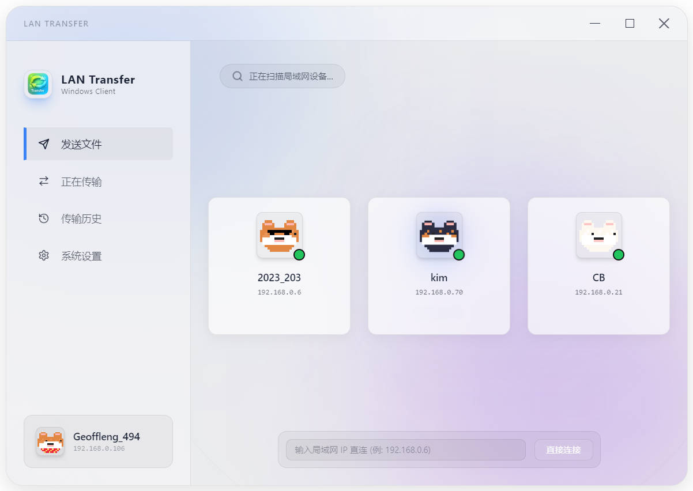
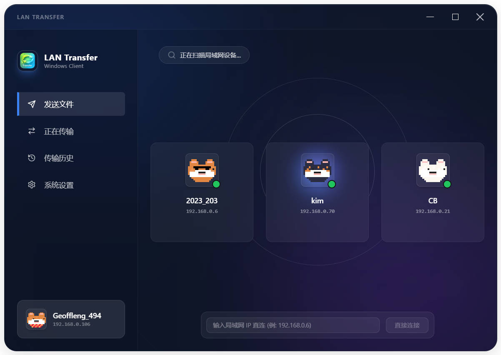

# 🚀 LAN Transfer - 极速局域网文件传输工具


**LAN Transfer** 是一款基于 Electron + React + Tailwind CSS 构建的极速局域网（LAN）文件传输助手。它拥有极简的 iOS 灵动岛风格 UI 交互、支持白天与黑夜双主题，并在局域网内实现了零配置、超高速的 P2P 直连文件互传。

---

## 📸 界面预览

> **💡 如何在 GitHub 上显示图片？**
> 1. 在项目根目录下新建一个名为 `docs` 的文件夹，并在里面建一个 `images` 子文件夹。
> 2. 将您的界面截图（如 `main_light.png` 和 `main_dark.png`）放入该文件夹内。
> 3. 在下方代码中引用它们的相对路径即可在 GitHub 页面上完美呈现。

| ☀️ 白天模式 | 🌙 黑夜模式 |
| :---: | :---: |
|  |  |

---

## ✨ 核心特性

*   **⚡ 极速 P2P 传输**：局域网内点对点直接建立 TCP 高速通道，传输速度仅受物理网卡和路由器带宽限制。
*   **🏝️ 灵动岛交互**：创新的悬浮灵动岛设计，实时显示传输进度、速度、剩余时间，支持随时暂停、继续或一键中止。
*   **🔍 双重自动发现**：集成 mDNS 组播广播与局域网段高速 TCP 轮询，打开软件即刻自动发现同局域网所有在线设备。
*   **🎨 精美双主题**：iOS 26 设计风格，丝滑磨砂玻璃质感，一键切换「白天」与「黑夜」模式。
*   **📂 路径自定义**：支持安装时自定义安装盘符，且支持在软件设置中自由更改接收文件夹。
*   **🔒 安全防护**：防目录穿越安全策略，保障文件传输过程中的系统数据安全。

---

## 📥 安装与运行

1.  下载最新的安装包 **`LAN Transfer_Setup_1.0.0.exe`**。
2.  双击运行，在安装向导中您可以选择安装到任意自定义路径（如 `D:\Programs\LAN Transfer`）。
3.  安装完成后，双击桌面生成的 **`LAN Transfer`** 快捷方式即可开启使用。

---

## 📖 使用指南

### 1. 发现设备
打开软件后，中央区域的雷达会自动扫描并展示局域网内同样开启了本软件的设备。

### 2. 发送文件
*   **方式一（雷达拖拽）**：直接点击雷达上对应的设备头像，在弹出的文件选择框中选择需要发送的文件，即可发起传输。
*   **方式二（IP 直连）**：如果因为网络限制未能在雷达上看到对方，可在软件下方输入框中手动输入对方电脑的 IP 地址（如 `192.168.0.106`），点击“直接连接”即可强行发起文件传输。

### 3. 接收文件
当有其他设备向您发送文件时，屏幕中央会弹出接听/拒绝框。点击**同意**即可开始全速接收。

---

## 🛠️ 常见网络与防火墙问题排查（非常重要）

如果您在传输时遇到“单向传输失败”（对方能发给你，但你发给对方收不到弹窗）或“找不到设备”，请按照以下步骤检查**接收方（无法弹出接收框的那台电脑）**：

### 1. 将网络类型切换为“专用网络”
*   Windows 默认会在“公用网络”下封锁所有局域网互连。
*   **操作**：点击电脑右下角的网络图标 -> 属性 -> 将网络配置文件类型由“公用”改为 **“专用”**。

### 2. 检查第三方安全软件拦截（如火绒、360）
*   Windows 自带防火墙放行后，第三方安全软件（如火绒、360 安全卫士、McAfee 等）的网络防火墙仍可能会静默拦截 `12138` 端口。
*   **操作**：尝试暂时关闭或退出第三方防护软件。若解决，请在防护软件的“网络防护/主动防御”中将本软件加入白名单。

### 3. 绕过系统权限限制强行放行端口
如果您在系统防火墙中看到 **“更改设置”按钮是灰色（提示此设置由您的组织管理）**：
*   **原因**：这是因为您的电脑账号不是管理员，或者加入了公司域/学校网络，安全策略被组策略锁死。
*   **解决办法**：
    1. 点击开始菜单，搜索 **`cmd`**（命令提示符）。
    2. 鼠标右键点击它，选择 **“以管理员身份运行”**。
    3. 复制并运行以下命令，即可直接在底层强行允许端口通过：
       ```cmd
       netsh advfirewall firewall add rule name="LAN-Transfer-TCP" dir=in action=allow protocol=TCP localport=12138 program="%LocalAppData%\Programs\LAN Transfer\LAN Transfer.exe"
       ```

---

## 💻 开发者指南

如果您想自行修改代码并进行本地调试或打包：

### 安装依赖
```bash
npm install
```

### 开发环境调试运行
```bash
npm run dev
```

### 编译打包成 Windows 安装包
```bash
npm run build
```
打包输出的目标安装包将存放在 `release/` 目录下。
